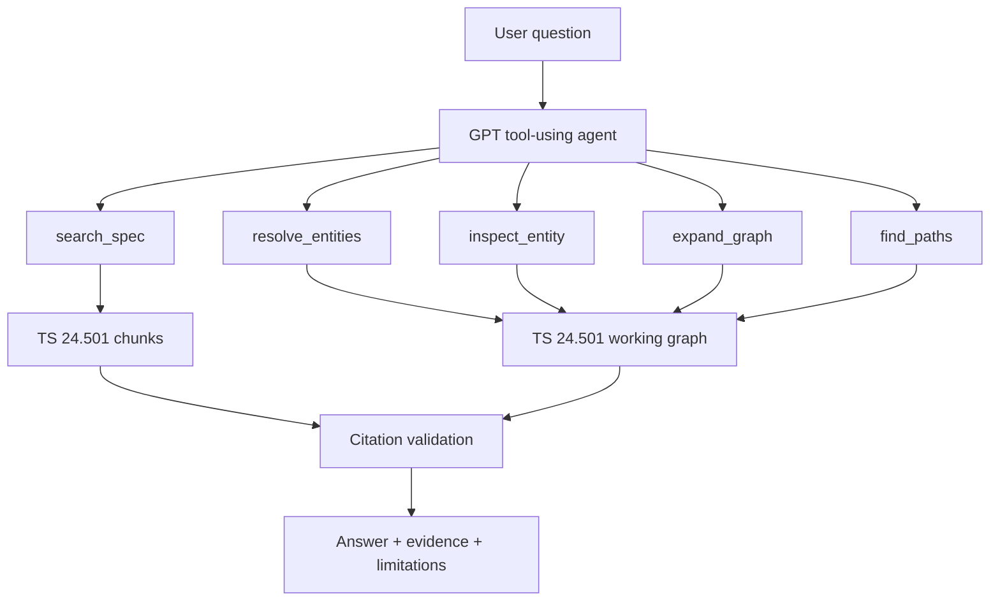

# 3GPP TS 24.501 GraphRAG Agent

> Evidence-grounded telecom standards assistant for 3GPP TS 24.501 v19.2.0, combining specification retrieval, knowledge-graph tools, and a GPT-powered agent.

[](#project-status)
[](https://www.python.org/)
[](https://developers.openai.com/api/docs/)
[](https://www.3gpp.org/)

## Overview

3GPP specifications are authoritative but hard to navigate: procedures span sections, terms are dense, and small exceptions can change the answer.

This project builds a focused assistant for **3GPP TS 24.501**. It does not answer standards questions from model memory alone. Instead, it retrieves specification chunks, optionally inspects a telecom knowledge graph, and returns answers with traceable evidence and validated `chunk_id` citations.

The repository is intentionally scoped to one specification first. That keeps parsing, graph alignment, retrieval quality, and citation safety measurable.

## What Works Now

The current prototype contains a working TS 24.501-focused GraphRAG pipeline with three connected layers:

### 1. TS 24.501 knowledge base construction

The project reconstructs a usable TS 24.501 evidence base from the official `24501-j20` specification source, rather than relying on the empty public `text` fields in the upstream chunk metadata.

The ingestion pipeline preserves standards-document structure:

- section numbers and section titles
- heading paths
- paragraph and table boundaries
- page metadata where available
- stable `chunk_id` values for citation checks

This produces a text corpus that can answer version-specific questions about TS 24.501 v19.2.0 with traceable source metadata.

### 2. TS 24.501-specific knowledge graph

The project builds a TS 24.501-specific knowledge graph around the structure of the standard itself. The goal is not to keep a large generic telecom graph and query it directly, but to extract the entities, relations, provenance, and textual anchors that are useful for reasoning over one concrete specification version.

The graph construction process follows the document-first shape of TS 24.501:

- start from the official `24501-j20` specification identity and treat it as the provenance anchor for TS 24.501 v19.2.0
- extract candidate telecom entities from section titles, definitions, message names, procedures, security concepts, and specification metadata
- normalize repeated labels, acronyms, and specification references into stable graph entities
- retain relations only when they remain interpretable in the TS 24.501 context, such as definition links, reference links, message/procedure associations, and security-context relationships
- keep endpoint nodes required to explain a retained relation instead of cutting edges into isolated fragments
- align graph entities and relations back to reconstructed specification chunks so graph evidence can be checked against text evidence
- label each graph-to-text match as verified, high-confidence, or candidate-level

This produces a graph layer that is specific enough to answer questions about TS 24.501, but still connected enough to explain how concepts such as NAS security context, replay protection, integrity verification, message formats, and procedure states relate to one another.

### 3. Evidence-grounded GPT agent

The runtime agent answers through bounded tools instead of free-form model memory:

- `search_spec` retrieves relevant TS 24.501 chunks
- `resolve_entities` maps user terms to graph entities
- `inspect_entity` returns graph properties and aligned evidence
- `expand_graph` explores bounded neighborhoods
- `find_paths` searches limited relationship paths

The agent runs through an OpenAI-compatible Responses API endpoint, supports custom base URLs, and includes a fallback for providers that support tool calls but do not reliably support stateful `previous_response_id` continuation.

Citation safety is enforced programmatically: if the final answer cites a `chunk_id` that was not returned by a tool during the same run, the answer is rejected.

The result is a CLI-ready prototype that can search the specification, inspect the graph, run retrieval evaluation, and answer TS 24.501 questions with explicit evidence limitations.

## Architecture



The model only receives bounded tool outputs. It does not get shell access, arbitrary file access, or unrestricted graph execution.

## Quick Start

```powershell
python -m venv .venv
.\.venv\Scripts\python.exe -m pip install -e .
Copy-Item .env.example .env
```

Edit `.env` locally:

```dotenv
OPENAI_API_KEY=your_api_key_here
OPENAI_MODEL=your_model_name
OPENAI_BASE_URL=
```

Run a deterministic retrieval command:

```powershell
.\.venv\Scripts\kg-agent.exe search-spec "replay protection for NAS signalling"
```

Build the document-first TS 24.501 graph layer:

```powershell
.\.venv\Scripts\kg-agent.exe build-graph
```

Ask the evidence-grounded agent:

```powershell
.\.venv\Scripts\kg-agent.exe ask "How is replay protection handled for NAS signalling?"
```

Use `--json` when you want the answer, response id, tool trace, and validated cited chunk ids as structured output.

Never commit `.env` or an API key. See [docs/api_configuration.md](docs/api_configuration.md) for custom endpoint notes.

## Useful Commands

```powershell
.\.venv\Scripts\kg-agent.exe ask "How is replay protection handled for NAS signalling?" --json
.\.venv\Scripts\kg-agent.exe build-graph
.\.venv\Scripts\kg-agent.exe search-spec "5G NAS security context"
.\.venv\Scripts\kg-agent.exe resolve "Replay protection"
.\.venv\Scripts\kg-agent.exe inspect "Replay protection"
.\.venv\Scripts\kg-agent.exe neighbors "Replay protection"
.\.venv\Scripts\kg-agent.exe path "Replay protection" "message integrity"
.\.venv\Scripts\kg-agent.exe eval-retrieval
```

See [examples/demo_queries.md](examples/demo_queries.md) for demo prompts.

## Project Status

This is a working prototype, not a finished standards product.

Current local data foundation:

- 2,056-node document-built TS 24.501 working graph
- 2,891 provenance-carrying graph edges
- 828 illegal candidate triples blocked by the schema whitelist during deterministic construction
- 3,037 structure-aware specification chunks
- 3,036 chunks with section-start page metadata
- BM25 Recall@5 of 1.0 on an initial 8-question engineering set

Reports:

- [Retrieval baseline](reports/retrieval_baseline.md)

Known limitations:

- The evaluation set is still small and engineering-oriented.
- The upstream published text chunks contain empty `text` fields, so this project reconstructs usable chunks from the official TS 24.501 document.
- The current self-built graph is a deterministic skeleton: sections, section-defined entities, external references, and provenance-carrying graph edges are live; richer behavioral relations still require the next schema-constrained extraction pass.
- Many procedural answers still rely primarily on text retrieval.
- The Streamlit UI is not included yet. The CLI is the supported interface.

## Testing and Evaluation

The evaluation direction is inspired by the [GSMA Open-Telco LLM benchmark](https://hugging-face.cn/blog/otellm/gsma-benchmarks), which emphasizes telecom-specific evaluation rather than generic chat quality. The GSMA benchmark article highlights the need to test:

- telecom domain knowledge and technical terminology, similar to TeleQnA
- 3GPP technical-document understanding and extraction, similar to 3GPPTdocs
- mathematical and logical reasoning, represented by MATH500 and FOLIO
- practical telecom tasks such as troubleshooting, optimization, safety, and compliance

This repository currently focuses on the second category: **3GPP technical-document understanding for TS 24.501**. For that reason, the project does not claim an official GSMA Open-Telco leaderboard score. Instead, the evaluation roadmap is:

1. Expand the reviewed TS 24.501 question set from 8 questions to a larger mix of definitions, procedures, conditions, message fields, cross-references, and insufficient-evidence cases.
2. Measure retrieval quality with Recall@K, MRR, and section-level coverage.
3. Measure answer quality with citation accuracy, unsupported-claim rate, answer-point coverage, and evidence-limitation quality.
4. Add task families inspired by GSMA's categories: TeleQnA-style terminology questions, 3GPP document-understanding questions, logical cross-section reasoning, and security/compliance scenarios.
5. Keep benchmark data, prompts, model configuration, and generated reports reproducible so results can be compared under clear conditions.

## API Compatibility

The runtime uses the OpenAI Python SDK and the Responses API tool-calling format.

Some custom OpenAI-compatible endpoints support basic `/v1/responses` calls but do not support stateful `previous_response_id` continuation consistently. The agent includes a narrow fallback for this case: if the provider reports that a response item was created under a different Azure OpenAI resource, the runtime retries the tool-output step without `previous_response_id` and with minimal function-call items.

See [docs/api_configuration.md](docs/api_configuration.md).
