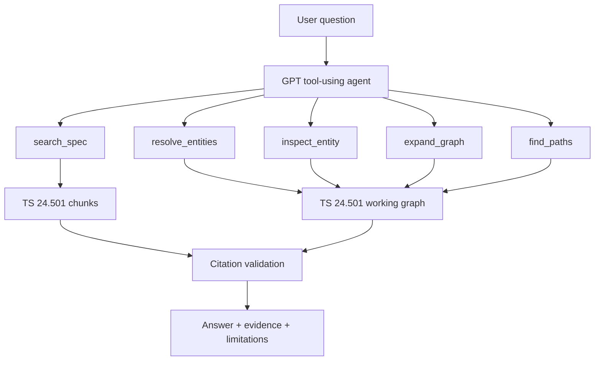

# 3GPP TS 24.501 GraphRAG Agent

> Evidence-grounded telecom standards assistant for 3GPP TS 24.501 v19.2.0, combining specification retrieval, knowledge-graph tools, and a GPT-powered agent.

[](#project-status)
[](https://www.python.org/)
[](https://developers.openai.com/api/docs/)
[](LICENSE)
[](https://www.3gpp.org/)

## Overview

3GPP specifications are authoritative but hard to navigate: procedures span sections, terms are dense, and small exceptions can change the answer.

This project builds a focused assistant for **3GPP TS 24.501**. It does not answer standards questions from model memory alone. Instead, it retrieves specification chunks, optionally inspects a telecom knowledge graph, and returns answers with traceable evidence and validated `chunk_id` citations.

The repository is intentionally scoped to one specification first. That keeps parsing, graph alignment, retrieval quality, and citation safety measurable.

## What Works Now

- Parses TS 24.501 v19.2.0 (`24501-j20`) into section-aware chunks.
- Exports a provenance-focused TS 24.501 working subgraph from the Release 19 telecom KG.
- Searches the specification with telecom-aware BM25 tokenization.
- Provides bounded graph tools for entity resolution, neighborhood expansion, and path search.
- Runs a GPT tool-calling agent through an OpenAI-compatible Responses API endpoint.
- Rejects final answers that cite `chunk_id` values not returned by tools in the same run.
- Includes tests for retrieval, graph export, agent tool loops, citation guards, and custom endpoint fallback behavior.

## Architecture



The model only receives bounded tool outputs. It does not get shell access, arbitrary file access, or unrestricted graph execution.

## Quick Start

### 1. Create the environment

```powershell
python -m venv .venv
.\.venv\Scripts\python.exe -m pip install -e .
```

Optional extras:

```powershell
.\.venv\Scripts\python.exe -m pip install -e ".[ingestion]"
.\.venv\Scripts\python.exe -m pip install -e ".[retrieval]"
.\.venv\Scripts\python.exe -m pip install -e ".[dev]"
```

### 2. Configure the API

```powershell
Copy-Item .env.example .env
```

Then edit `.env` locally:

```dotenv
OPENAI_API_KEY=your_api_key_here
OPENAI_MODEL=your_model_name
OPENAI_BASE_URL=
```

For a compatible custom endpoint, set `OPENAI_BASE_URL`, for example:

```dotenv
OPENAI_BASE_URL=https://your-provider.example/v1
```

Never commit `.env` or an API key.

### 3. Run the CLI

```powershell
.\.venv\Scripts\kg-agent.exe search-spec "replay protection for NAS signalling"
```

Ask the agent:

```powershell
.\.venv\Scripts\kg-agent.exe ask "How is replay protection handled for NAS signalling?"
```

Structured output:

```powershell
.\.venv\Scripts\kg-agent.exe ask "How is replay protection handled for NAS signalling?" --json
```

Example JSON includes:

- final answer
- response id
- bounded tool trace
- validated cited chunk ids

## CLI Commands

```powershell
.\.venv\Scripts\kg-agent.exe audit-graph
.\.venv\Scripts\kg-agent.exe export-subgraph
.\.venv\Scripts\kg-agent.exe ingest-spec --source data\external\specifications\24501-j20\24501-j20.docx
.\.venv\Scripts\kg-agent.exe search-spec "5G NAS security context"
.\.venv\Scripts\kg-agent.exe resolve "Replay protection"
.\.venv\Scripts\kg-agent.exe inspect "Replay protection"
.\.venv\Scripts\kg-agent.exe neighbors "Replay protection"
.\.venv\Scripts\kg-agent.exe path "Replay protection" "message integrity"
.\.venv\Scripts\kg-agent.exe align
.\.venv\Scripts\kg-agent.exe eval-retrieval
.\.venv\Scripts\kg-agent.exe build-vector
.\.venv\Scripts\kg-agent.exe search-hybrid "How is NAS replay protection handled?"
.\.venv\Scripts\kg-agent.exe ask "How is replay protection handled for NAS signalling?"
```

See [examples/demo_queries.md](examples/demo_queries.md) for demo prompts.

## Project Status

This is a working prototype, not a finished standards product.

Current local data foundation:

- 421-node TS 24.501 working subgraph
- 184 working-subgraph edges
- 3,037 structure-aware specification chunks
- 3,036 chunks with section-start page metadata
- BM25 Recall@5 of 1.0 on an initial 8-question engineering set

Reports:

- [TS 24.501 graph audit](reports/ts24501_graph_audit.md)
- [Retrieval baseline](reports/retrieval_baseline.md)

Known limitations:

- The evaluation set is still small and engineering-oriented.
- The upstream published text chunks contain empty `text` fields, so this project reconstructs usable chunks from the official TS 24.501 document.
- Graph evidence is strongest around definitions and early security/access-control sections; many procedural answers still rely primarily on text retrieval.
- The Streamlit UI is not included yet. The CLI is the supported interface.

## Testing and Evaluation

The current test suite has two layers.

First, the repository has deterministic engineering tests:

```powershell
$env:PYTHONPATH='tests'
.\.venv\Scripts\python.exe -m unittest discover -s tests -v
```

These tests cover:

- DOCX ingestion and section/table preservation
- telecom-aware BM25 tokenization and section filtering
- graph audit, subgraph export, entity resolution, neighbors, and paths
- graph-to-text lexical alignment
- retrieval metric calculation
- vector/RRF retrieval behavior with a fake embedder
- GPT Responses API tool-loop behavior using fake clients
- custom endpoint fallback for `previous_response_id` compatibility issues
- rejection of invented `chunk_id` citations

Second, the project has a small retrieval baseline:

```powershell
.\.venv\Scripts\kg-agent.exe eval-retrieval --output reports\generated\bm25_eval.json
```

The current baseline uses [examples/retrieval_eval.json](examples/retrieval_eval.json), an initial 8-question engineering set focused on TS 24.501 section retrieval. It reports Recall@K and MRR for whether the retriever surfaces chunks from the expected sections. This is useful as a regression check, but it is not a full telecom LLM benchmark.

### GSMA Open-Telco benchmark alignment

The evaluation direction is inspired by the [GSMA Open-Telco LLM benchmark](https://hugging-face.cn/blog/otellm/gsma-benchmarks), which emphasizes telecom-specific evaluation rather than generic chat quality. The GSMA benchmark article highlights the need to test:

- telecom domain knowledge and technical terminology, similar to TeleQnA
- 3GPP technical-document understanding and extraction, similar to 3GPPTdocs
- mathematical and logical reasoning, represented by MATH500 and FOLIO
- practical telecom tasks such as troubleshooting, optimization, safety, and compliance

This repository currently focuses on the second category: **3GPP technical-document understanding for TS 24.501**. For that reason, the project does not claim an official GSMA Open-Telco leaderboard score. Instead, the evaluation roadmap is:

1. Expand the reviewed TS 24.501 question set from 8 questions to a larger mix of definitions, procedures, conditions, message fields, cross-references, and insufficient-evidence cases.
2. Measure retrieval quality with Recall@K, MRR, and section-level coverage.
3. Measure answer quality with citation accuracy, unsupported-claim rate, answer-point coverage, and evidence-limitation quality.
4. Add task families inspired by GSMA's categories: TeleQnA-style terminology questions, 3GPP document-understanding questions, logical cross-section reasoning, and security/compliance scenarios.
5. Keep benchmark data, prompts, model configuration, and generated reports reproducible so results can be compared under clear conditions.

## API Compatibility

The runtime uses the OpenAI Python SDK and the Responses API tool-calling format.

Some custom OpenAI-compatible endpoints support basic `/v1/responses` calls but do not support stateful `previous_response_id` continuation consistently. The agent includes a narrow fallback for this case: if the provider reports that a response item was created under a different Azure OpenAI resource, the runtime retries the tool-output step without `previous_response_id` and with minimal function-call items.

See [docs/api_configuration.md](docs/api_configuration.md).

## Data Provenance

The existing telecom knowledge graph is third-party data, not created by this repository.

Dataset:

- [GSMA/telecom-kg-rel19](https://huggingface.co/datasets/GSMA/telecom-kg-rel19)

Target specification:

- 3GPP TS 24.501 v19.2.0
- Source code: `24501-j20`
- Official archive: `https://www.3gpp.org/ftp/Specs/archive/24_series/24.501/24501-j20.zip`

Downloaded specifications, generated chunks, generated indexes, and bulk third-party data are excluded from Git by default.

## Development

Run tests:

```powershell
$env:PYTHONPATH='tests'
.\.venv\Scripts\python.exe -m unittest discover -s tests -v
```

Run release safety checks:

```powershell
.\scripts\check_release.ps1
```

Optional dev checks after installing `.[dev]`:

```powershell
.\.venv\Scripts\python.exe -m ruff check .
.\.venv\Scripts\python.exe -m pyright
```

## Scope

This project is not:

- a complete implementation of every 3GPP specification
- a replacement for official standards documents
- a guarantee of standards compliance
- a production network decision system

Use it as a research and demonstration project for evidence-grounded telecom standards question answering.

## Acknowledgements

- GSMA and KU-DF for publishing the telecom knowledge-graph dataset
- 3GPP for the technical specifications on which the domain data is based
- OpenAI-compatible APIs for the runtime agent
- Claude Code / Codex-style agentic development workflows for implementation assistance

## License

Source code in this repository is licensed under the MIT License. See [LICENSE](LICENSE).

Third-party datasets and standards documents have their own terms. See [NOTICE](NOTICE).
